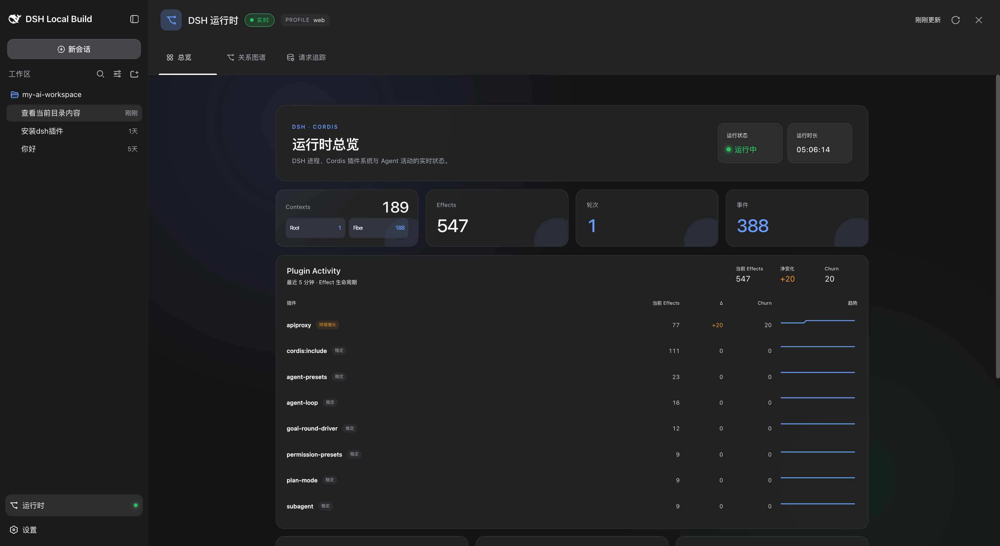
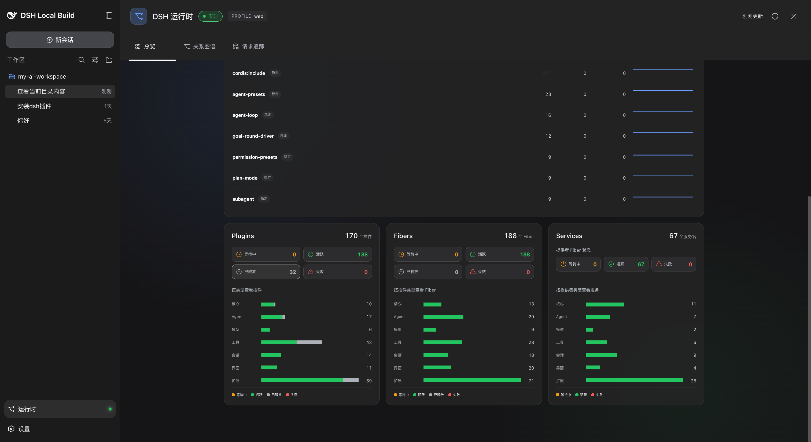
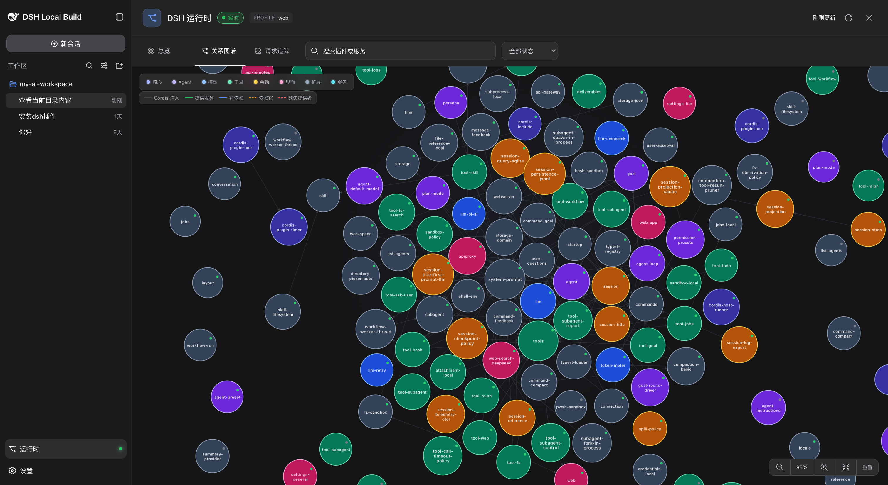
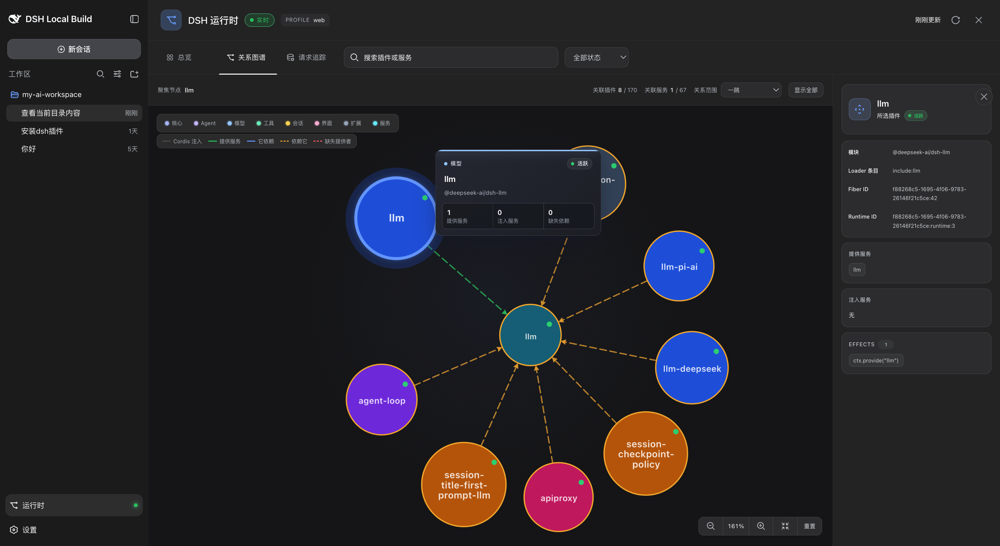
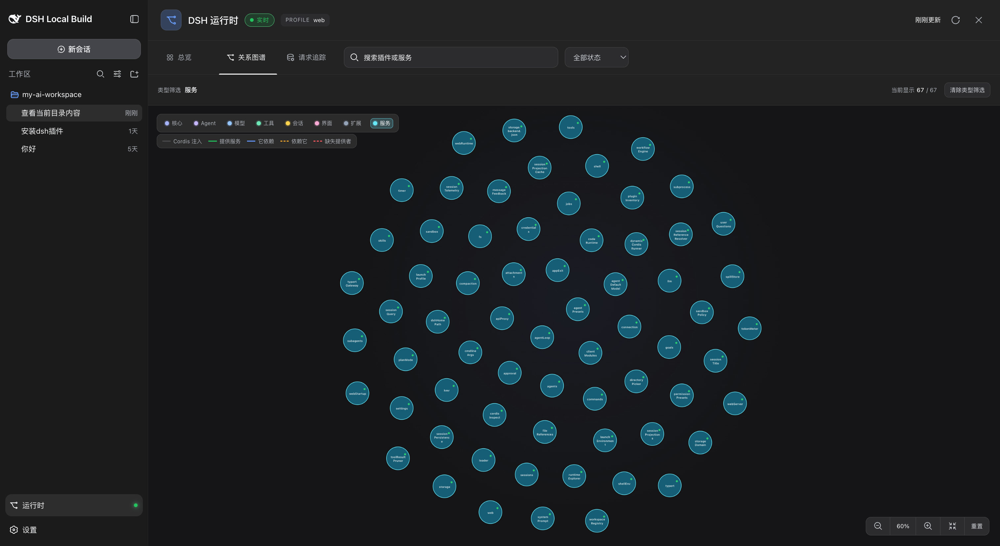
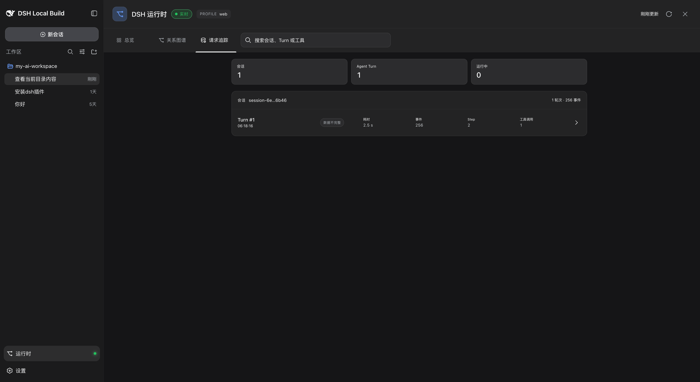

# dsh-runtime

中文 | [English](README_EN.md)

`dsh-runtime` 是 DeepSeek Harness 的只读 Runtime Explorer，以一个独立的
双端 DSH 插件发布：Host 端负责投影 Cordis 运行时状态和隐私安全的 Session
事件元数据，Web 端负责渲染关系图谱与请求追踪。总览还会按插件显示 Effect
的当前数量、净变化、生命周期活跃度、趋势和有界的最近转换记录。

## 界面预览

### 运行时总览

总览集中展示进程健康状态、Cordis Context、Effect 活动、Agent 轮次、事件以及
各插件的生命周期趋势。



Plugins、Fibers 和 Services 分布卡片会按状态与插件类型解释同一份运行时数据。



### 关系图谱

关系图谱将 DSH 插件与 Cordis 服务显示为不同类型的节点，并区分依赖、提供、
消费、注入和缺失提供者等关系。



选中插件后可以查看它的运行时身份和关系邻域，也可以筛选出全部已注册的服务节点。

<a href="docs/images/runtime-node-inspector.png"></a>
<a href="docs/images/runtime-service-filter.png"></a>

### 请求追踪

请求追踪先按 Session 和 Agent Turn 组织捕获到的元数据，再进入所选 Turn 的详细
事件流。



## 安装

将公开包安装到 Web profile，然后重启该 profile：

```sh
dsh plugin --profile web add @howardchan/dsh-runtime
```

整个接入不需要修改 Harness 源码，也不需要改中央 Remote 注册表。

## 包结构

- `packages/dsh-runtime`：唯一可发布的 npm 包，包名为 `@howardchan/dsh-runtime`。
- `packages/runtime`：私有 Host 源码与构建单元。
- `packages/ui-runtime`：私有 Web 源码与构建单元。

公开包同时携带 Host 网关、Web 界面、生成的 Remote contribution 和 Bundle patch。

## 当前开发基线

首版 `0.1.0` 从 DeepSeek Harness 提交 `141eb6fef8` 抽取，并在本地 Harness
`0.1.0-rc.8` 包族上验证。npm 当前公开的 DSH 包仍是较旧的
`0.0.1-rc.1`，因此现阶段源码构建和测试需要在同级、同基线的 Harness
仓库中执行。仓库包含已经验证的 `lib/` 构建产物和组装后的公开包；DSH peer
依赖保持 optional，由所选 profile 在运行时提供。安装仍要求兼容的 DSH
`0.1.0-rc.8` 包族，不能把旧的公开 npm 包族视为兼容版本。

准确的接入边界见 [integration/README.zh.md](integration/README.zh.md)。

## 验证

```sh
npm run verify
npm run pack:dry-run
```

独立 Bundle 测试直接在本仓库执行；Web 源码单元的浏览器集成测试在匹配的
Harness 工作区内执行。

## 隐私边界

请求追踪只保存元数据：Session id、事件类型、序号、时间、泳道、Turn、Step、
Call id、工具名、结果状态和序列化后的载荷长度。Runtime 快照不会暴露提示词、
模型输出、工具参数、工具结果或失败消息。

## 许可证

MIT
